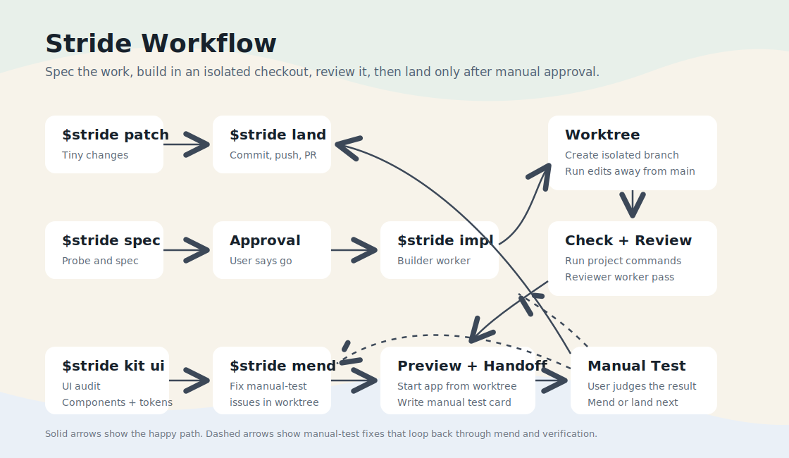

# Stride Workflow

Stride Workflow is a Codex-first workflow tool for working inside a repo without losing the shape of the work.

## At A Glance



It helps you:

- frame the task before changing files
- carry the work through safely
- keep manual testing tied to the right checkout
- use a lighter path for tiny edits
- turn repeated frontend UI into a reusable kit

For the technical workflow, commands, phases, and install details, see [docs/technical-overview.md](docs/technical-overview.md).

## Install

```bash
npx github:jayrmiso/stride-workflow init
```

## License

MIT
